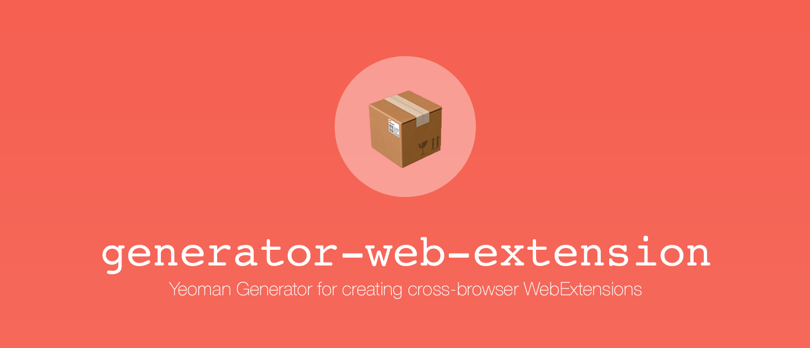

[](https://travis-ci.org/HaNdTriX/generator-web-extension) 
[](https://www.npmjs.com/package/generator-web-extension)
[](https://github.com/feross/standard)
[](https://github.com/HaNdTriX/generator-web-extension/blob/master/LICENSE)

Advanced WebExtension generator that creates everything you need to get started with cross-browser web-extension development. 

Under the hood it uses [webextension-toolbox](https://github.com/HaNdTriX/webextension-toolbox) for compiling the extensions.

## Install

```shell
$ npm install -g yo generator-web-extension
```

## Getting Started

1. First make a new directory, and `cd` into it: `mkdir my-web-extension && cd $_`
2. Run: `yo web-extension`.

## Options

* `--skip-install`

  Skips the automatic execution of `npm` after
  scaffolding has finished.

## License

Copyright 2018 Henrik Wenz

This project is free software released under the MIT license.
